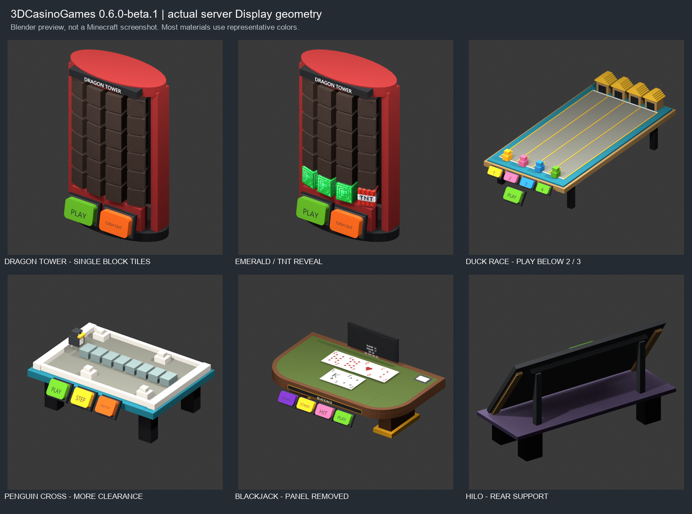

# 3DCasinoGames

[](https://github.com/GoldenEggOVO/3DCasinoGames/actions/workflows/ci.yml)

Standalone 3D casino machines for **Paper / Purpur 26.2 and Java 25**. Plugin, commands, permissions and model namespace: **3dcasino**. Current version: **0.6.0-beta.1**.

**Install one JAR. No CraftEngine, resource pack or client mod is required.** Physical machines are free practice: they do not withdraw money or award an economy balance.



*Blender renders of server-exported Display geometry, not Minecraft screenshots. Most materials use representative block colors.*

## Install

1. Download `3dcasino-0.6.0-beta.1.jar` from [Releases](https://github.com/GoldenEggOVO/3DCasinoGames/releases).
2. Stop the server, back up plugin data and worlds, and place the JAR in `plugins/`. Keep only one version installed.
3. Start the server and use `/3dcasino` or `/3dcasino create blackjack`.

Defaults are `machine-appearance: vanilla`, `menu-enabled: true`, and `language: en_US`. Editable language files are generated under `plugins/3dcasino/languages/`; see [languages](docs/languages.md).

**Breaking upgrade:** 0.6 uses a new data directory and namespace. Old commands, permissions, Java packages and automatic migration adapters are not provided. Read [installation and upgrade](docs/installation.md) before replacing an earlier version.

Vault and AuthMe are optional. ServerGames, ServerBoards, ServerMenu and KaMenu are not required.

## Games

Blackjack, Mines, Crash, Plinko, Slots, Duck Race, Wheel of Fortune, Money Wheel, Penguin Cross, Keno, Hilo and Dragon Tower.

- Vanilla block and text displays, rotated curved edges and consistent buttons.
- All 52 playing cards plus a card back; the lower corner is rotated 180 degrees.
- Native Dialog menus, physical buttons, practice stakes and editable machine definitions.
- Permanent machine placements, restored after restarts and chunk loads. One machine of each game per player. Active rounds and animations do not survive a restart.
- Optional native resource-pack mode and a model resolver API for advanced custom appearances.

## Commands and permissions

| Command | Purpose |
| --- | --- |
| `/3dcasino` | Open the native management menu |
| `/3dcasino create <game> [skin-id]` | Create a free practice machine |
| `/3dcasino bet <game> <1-100>` | Change the stake on your nearby idle machine |
| `/3dcasino remove [game]` | Remove one game or all your machines |
| `/3dcasino reload-models` | Validate and reload machine definitions for new placements |

Tab completion filters games, matching skins and your own machines. `3dcasino.use` defaults to everyone; `3dcasino.machine` defaults to operators. Shift + right-click opens machine settings. This plugin does not bind Shift + F.

Set `menu-enabled: false` and restart to disable Dialog. Commands, physical buttons, persistence and settlement services continue working.

## Economy extension

Physical machines remain free. Vault and `EconomyProvider` remain optional extension points; settlement records are not discarded. The menu does not offer new paid rounds. Amounts use integer cents; uncertain transfers stay pending for reconciliation.

After checking economy-provider evidence, an administrator may use console-only `3dcasino resolve <player-uuid> <round-uuid> applied|not-applied` or `3dcasino mines resolve ...`. These commands record the verified outcome and do not transfer money. Never guess the outcome or delete a record to bypass reconciliation.

## Build and documentation

```sh
mvn -B -ntp package
python -m pip install -r tools/requirements-dev.txt
python -m unittest discover -s tools -p "test_*.py"
```

Use JDK 25 and Maven 3.9+. The first build downloads public dependencies. Install `target/3dcasino-*.jar`, never `original-*.jar`. Building the plugin does not require Blender, model generation or local fonts.

- [Installation](docs/installation.md) · [Languages](docs/languages.md) · [Verification](docs/verification.md)
- [Custom models](docs/custom-models.md) · [API](docs/architecture.md) · [Visual review](docs/vanilla-visual-review.md)
- [Resource tools](docs/resources.md) · [Changelog](CHANGELOG.md) · [Contributing](CONTRIBUTING.md)

Licensed under [GPL-3.0](LICENSE). See [third-party materials](THIRD_PARTY.md). Production settings, private fonts and third-party server/plugin binaries are excluded.
