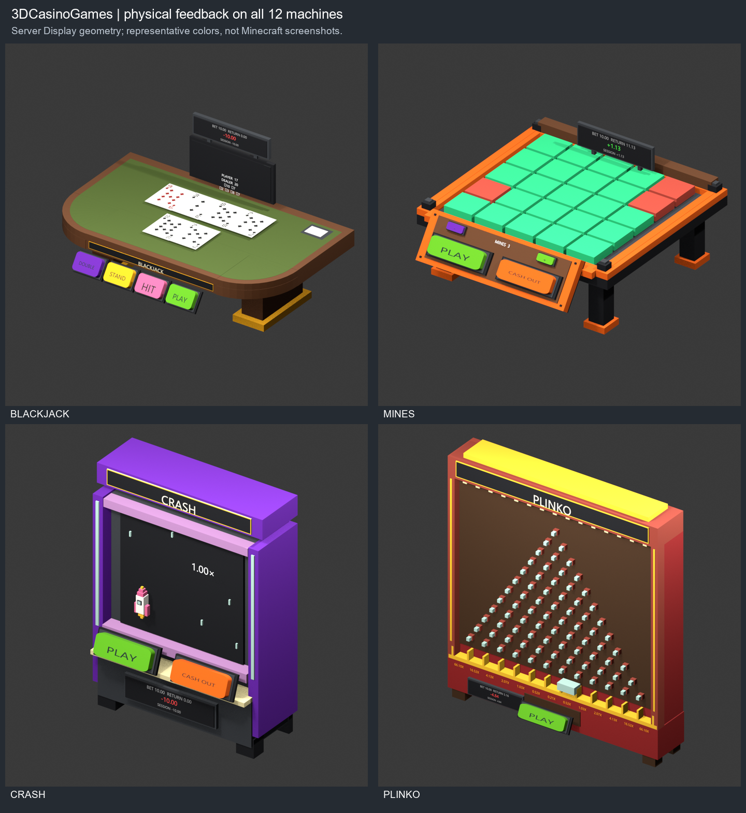
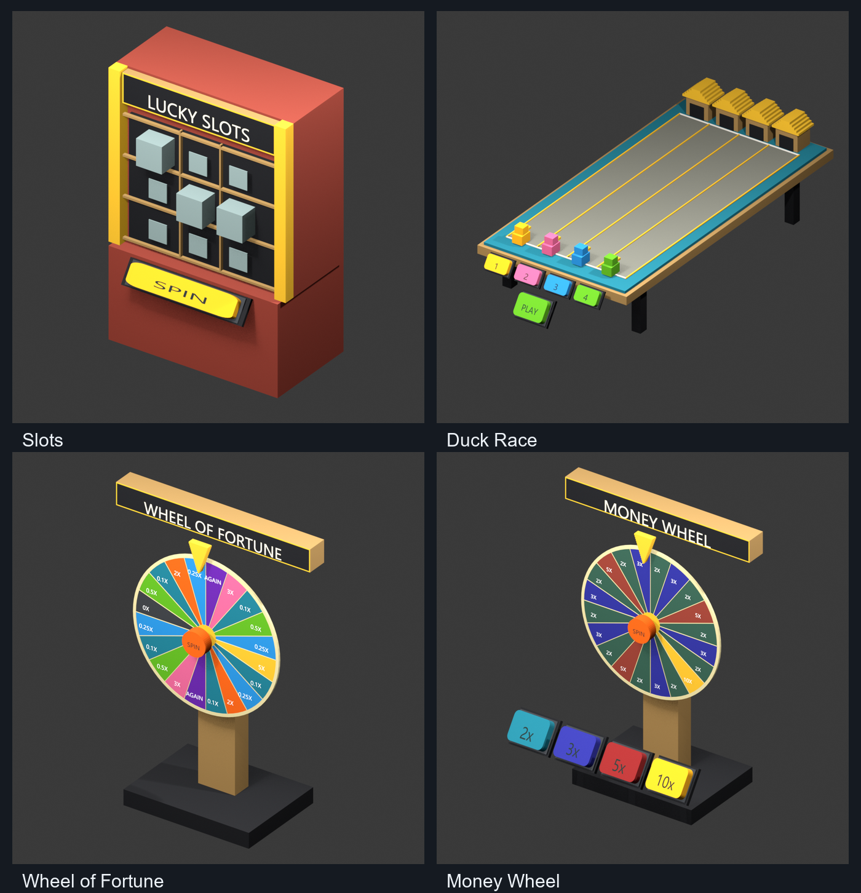
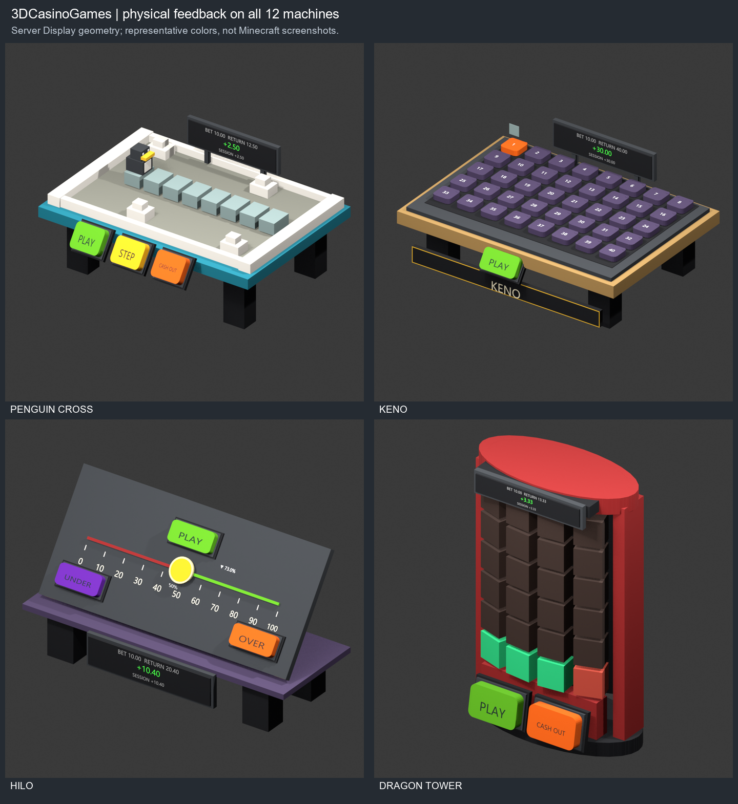

# 3DCasinoGames

[](https://github.com/GoldenEggOVO/3DCasinoGames/actions/workflows/ci.yml)

[English](README.md) | [简体中文](README.zh-CN.md)

## 全部机器展示







*图片根据服务端实际 Display 实体几何渲染，并非游戏内截图。*

## 安装

需要 **Paper / Purpur 26.2 或 26.3 和 Java 25**。同一个 JAR 支持这两个 Minecraft 版本，无需资源包或客户端模组。已测试的 26.3 服务端构建仍为实验版，详见[兼容性验证](docs/verification.md#cross-version-compatibility)。

1. 从 [Beta 发布页](https://github.com/GoldenEggOVO/3DCasinoGames/releases/tag/v0.6.0-beta.2) 下载 `3dcasino-0.6.0-beta.2.jar`。
2. 停服并备份插件数据和世界，将 JAR 放入 `plugins/`，同一插件只保留一个版本。
3. 启动服务器，使用 `/3dcasino` 打开菜单，或使用 `/3dcasino create blackjack` 创建机器。

默认配置为 `menu-enabled: true`、`language: en_US`。可编辑语言文件会生成到 `plugins/3dcasino/languages/`。将 `config.yml` 中的语言改为 `language: zh_CN` 并执行 `/3dcasino reload-language`，即可使用中文；详见[语言配置](docs/languages.md)。

**不兼容升级：** 0.6 使用新的数据目录和命名空间，不提供旧命令、旧权限、旧 Java 包或自动迁移适配。替换旧版本前，请阅读[安装与升级说明](docs/installation.md)。

Vault 和 AuthMe 为可选集成。

## 功能

全部 12 种实体机器均为免费练习，不扣除或发放经济插件余额。

- 原版方块和文字显示实体、旋转片段圆边及统一按钮。
- 全部 12 台机器带下注、返还、净盈亏屏幕及对应动作的原版音效；累计为本机加载期间的练习记录，不是经济余额。[反馈说明](docs/machine-feedback.md)。
- 完整的 52 张扑克牌和牌背，右下角牌面标记旋转 180°。
- 原生 Dialog 菜单、实体按钮、练习下注和可编辑机器定义。
- 机器布置永久保存，在重启或区块加载后恢复。每位玩家每种游戏可放置一台；当前对局和动画不跨重启恢复。
- 内置机器始终使用原版几何；显式配置外部自定义物品时仍可使用模型解析接口。

## 命令与权限

| 命令 | 用途 |
| --- | --- |
| `/3dcasino` | 打开原生管理菜单 |
| `/3dcasino menu` | 明确打开原生管理菜单 |
| `/3dcasino create <game> [skin-id]` | 创建免费练习机器 |
| `/3dcasino bet <game> <1-100>` | 修改自己附近空闲机器的练习下注 |
| `/3dcasino remove [game]` | 删除指定游戏或自己的全部机器 |
| `/3dcasino reload-language` | 校验并应用语言修改，无需重启 |
| `/3dcasino reload-models` | 校验并重载机器定义，新创建的机器使用新定义 |

Tab 补全会筛选游戏、对应皮肤和自己的机器。`3dcasino.use` 默认允许所有玩家，`3dcasino.machine` 默认仅允许 OP。`3dcasino.admin` 默认仅允许 OP，用于语言重载。Shift＋右键机器可打开设置。

设置 `menu-enabled: false` 并重启可关闭 Dialog，命令、实体按钮、保存恢复和结算服务继续运行。

## 经济扩展

实体机器保持免费。Vault 和 `EconomyProvider` 仍是可选扩展接口，已有结算记录不会被丢弃；菜单不提供新开收费对局。金额使用整数最小单位 cents，不确定的转账会保留为待核对状态。

管理员核实经济插件记录后，可在控制台执行 `3dcasino resolve <player-uuid> <round-uuid> applied|not-applied`；Mines 使用 `3dcasino mines resolve ...`。这些命令只记录已核实的结果，本身不转账。不要猜测结果或删除存档来绕过核对。

## 构建与文档

```sh
mvn -B -ntp package
python -m pip install -r tools/requirements-dev.txt
python -m unittest discover -s tools -p "test_*.py"
```

使用 JDK 25 和 Maven 3.9+。首次构建会下载公开依赖。安装 `target/3dcasino-*.jar`，不要安装 `original-*.jar`。构建插件不需要 Blender、模型生成或本地字体。

- [安装说明](docs/installation.md) · [语言配置](docs/languages.md) · [验证记录](docs/verification.md)
- [自定义模型](docs/custom-models.md) · [扩展接口](docs/architecture.md) · [机器反馈](docs/machine-feedback.md)
- [更新记录](CHANGELOG.md) · [参与开发](CONTRIBUTING.md)

项目采用 [GPL-3.0](LICENSE) 许可，素材来源详见[第三方说明](THIRD_PARTY.md)。仓库不包含生产配置、私有字体或第三方服务端及插件二进制文件。部分详细文档使用英文。
