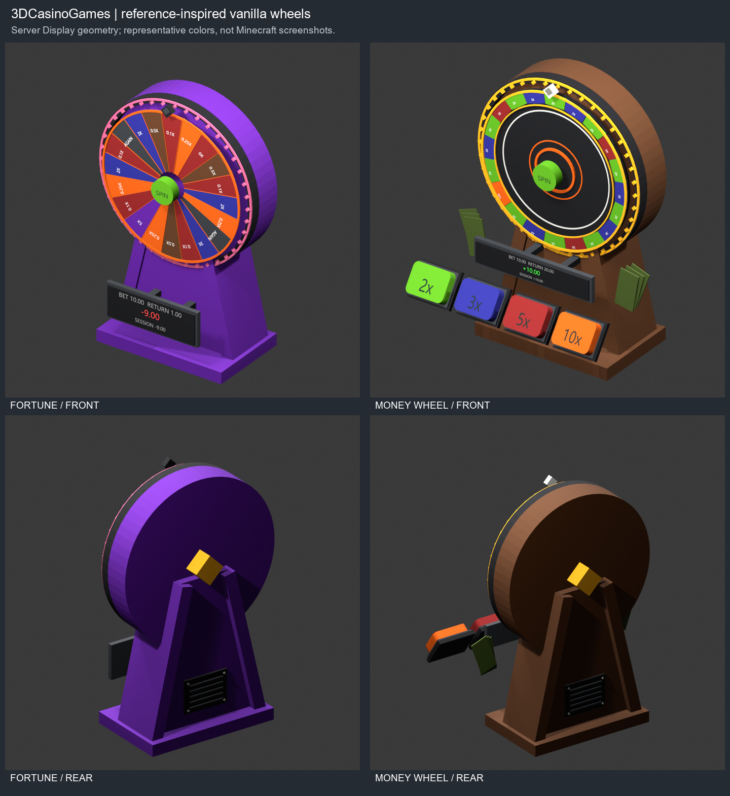

# Physical practice feedback

Every built-in machine has a fixed readout and vanilla sound cues. Install the
plugin JAR only; no sound pack, resource pack or additional plugin is needed.

## What the readout means

- **BET** is the practice stake. **RETURN** includes the returned stake.
- The large signed number is **net = return - stake**. A 10.00 stake returning
  2.50 shows **-7.50**, with a loss sound. Returning 20.00 shows **+10.00**.
- **SESSION** is the sum of settled net results on this loaded machine. It is
  shared by the machine's users, not a player account. It resets when the machine
  is removed, unloaded/recreated or the server restarts. Unfinished rounds are
  not included. It is neither saved nor sent to an economy provider.
- **CASH OUT** previews the available return on active Mines, Crash, Penguin
  Cross and Dragon Tower rounds. **BALLS IN PLAY** counts concurrent Plinko balls.
- Losses are red, break-even is gray, wins are green, and returns of at least
  five times the stake are gold. These colors describe the actual result.

Finished results stay visible until the next play. Animated results appear only
after their visible reveal, including Blackjack dealing and Mines flips.
Blackjack doubling uses the doubled stake. Crash shows an early cashout
immediately and does not count it again when the rocket crashes. Each Plinko
ball settles once using the stake captured when that ball was launched.

These are free practice amounts: no money is withdrawn, no wallet is added, and
no balance is awarded. Existing game rules, payout tables, random draws and
machine placement persistence remain unchanged.

## Sound cues

| Machine | Cue |
| --- | --- |
| Blackjack | Card-dealing page turns, result after the final card arrives |
| Mines | Safe-tile ping, result after the flip |
| Crash | Rising note while climbing, result at cashout or crash |
| Plinko | Light fall ticks, landing click and each ball's result |
| Slots | Reel ticks and three separate stop clicks |
| Duck Race | Racing steps, final result |
| Wheel of Fortune / Money Wheel | Click when the wheel crosses a sector; spacing grows as it slows |
| Penguin Cross | Snow steps, splash on a fall |
| Keno | A ping for each revealed draw |
| Hilo | Slider movement ticks |
| Dragon Tower | Safe-floor ping, final result |

Results use a low note for a loss, a neutral note for break-even, and a short
ascending chime for a win. A large win gets one additional note. There is no
fabricated near-miss, changed probability or automatic replay except Fortune's
existing Spin Again rule.

Sounds use Minecraft's **Blocks** volume category and are sent only to players
within nine blocks of the machine origin. Queued notes are tick-driven and
discarded when the machine is cleared. Volume, pitch and timing are currently
defined in code; no new sound configuration file is generated.

## Language and layout

Edit `feedback.*` keys in `plugins/3dcasino/languages/en_US.yml` or another selected
language, then run `/3dcasino reload-language`. Keep named placeholders such as
`{amount}`, `{bet}` and `{count}`. Missing keys fall back to bundled English, so
existing language files do not need to be deleted. Readouts use the same safe
MiniMessage and text-fitting path as other machine text.

Readout positions are built-in per game and follow the `playfield` transform.
They add no clickable region. Custom cabinet geometry may need a corresponding
code-level readout layout adjustment. Existing button locations remain intact.

## Wheel models and previews

Fortune now has a purple housing, pink rim lamps and a dark diamond pointer.
Money Wheel uses a brown housing, black center, colored outer ring, white
pointer and four matching choice buttons. Both retain their original 20-sector
order and probabilities, and include rear supports, axle and vent details.
`python tools/refine_wheels.py` regenerates only the wheel-specific geometry.

These previews render actual Display snapshots exported from the local Purpur
probe. Blocks use representative colors and text uses a substitute font; item
sprites are approximate. They are not Minecraft screenshots. Client rendering,
sound mixing and interaction feel still require in-game acceptance.
