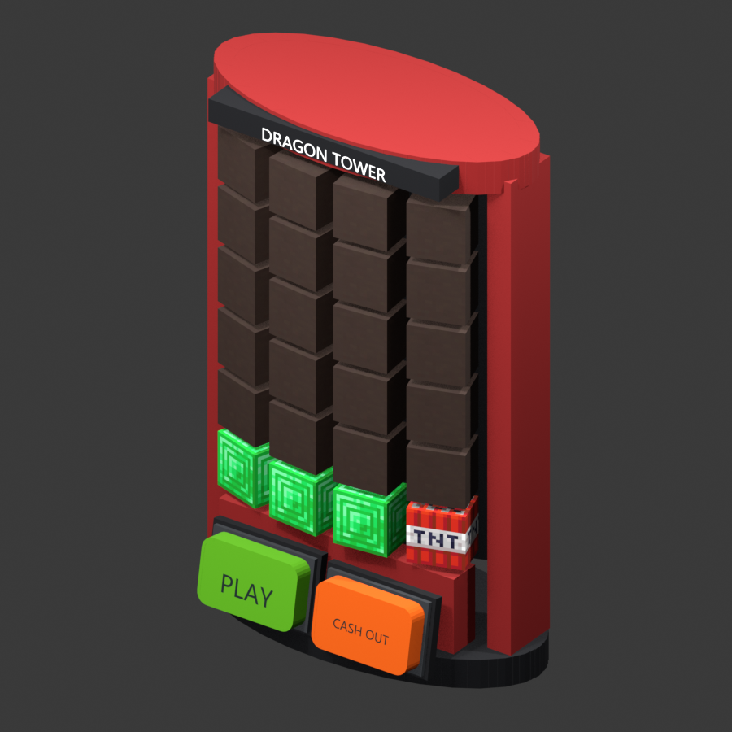

# Vanilla machine previews

## Current source: feedback and wheels

The README gallery now shows all 12 machines with physical feedback screens. The new wheel housings, pointers, rear vents and screen supports are shown in [front/rear previews](machine-feedback.md#wheel-models-and-previews). These current-source images use representative colors for blocks and simplified item sprites. Client textures, fonts and audio need in-game acceptance.

## Published beta preview

These are Blender renders of actual isolated-server Display snapshots. Most blocks use representative colors; Dragon Tower tile blocks use local Minecraft 26.2 textures. This is not a Minecraft screenshot. These older captures document the published beta geometry; the source gallery above includes later changes.

### Published beta changes

- Dragon Tower: hidden tiles are single gray terracotta blocks; revealed tiles are emerald/TNT blocks. The red upright body and buttons remain. Gray terracotta naturally has a warm brown-gray appearance in Minecraft.
- Hilo: two rear posts and a crossbar connect the panel to the table. The preview shows the rear so the support is visible.
- Penguin Cross: controls move 0.20 model units outward from the table.
- Duck Race: selection buttons move 0.22 units outward; PLAY is centered in a second row below buttons 2 and 3.
- Blackjack: the inclined panel behind the controls is removed; controls remain in place.
- Runtime text defaults to English and can be edited in YAML. Model label translations are fitted to their label area.

The [README showcase](../README.md#machine-showcase) displays all 12 machines. The rear support connection, table/button clearance, second-row position and removed panel were reviewed against locally generated before/after comparisons. Earlier accepted styling—rotated curved segments, solid-color controls, larger card patterns, inverted lower card corner, Mines layout and Hilo pointer animation—is retained.

## Verification boundary

Server checks cover matrix transforms, same-facing coplanar surfaces, multiple machine orientations, button interactions and restart cleanup. They cannot establish real client frame rate or rule out every visual artifact. See [verification](verification.md) for results and current entity counts. Minecraft appearance and interaction feel still need client acceptance.
