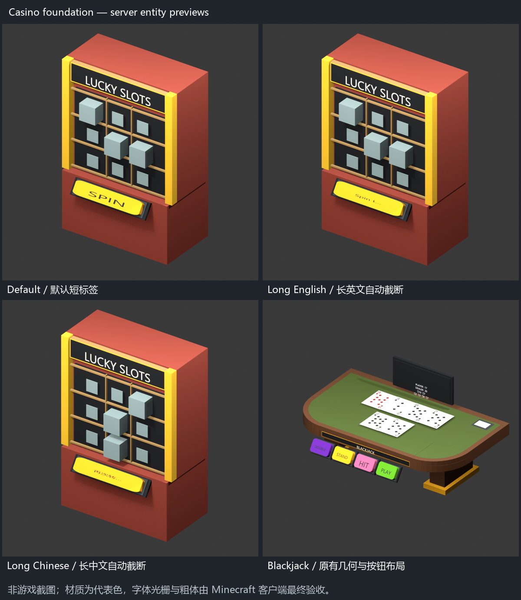

# Verification — 0.6.0-beta.1

## Published beta results

| Check | Result |
| --- | --- |
| JDK 25 / Maven package | 135 tests passed; no failures, errors or skipped tests |
| Python assets, geometry and packaging | 39 tests passed |
| Resource baseline | 871 files verified; namespace-only normalization for JSON, identical PNG bytes |
| Vanilla geometry exporter | 110 models; checked-in output reproduced |
| Clean Purpur 26.2 | Startup and two restarts passed; all processes exited normally |
| Ray targeting | 1857 samples passed across 0 / 37 / 90 / 180 degree placements |
| Display surface audit | 15 snapshots, zero same-facing coplanar overlaps |
| Namespace and Tab | Only new command, permission-filtered suggestions; invalid console UUID gives usage |
| Language | English default, generated files, edited machine label applied after restart, English fallback |

Release JAR SHA-256: `6f869119e091e117ea7f5b5c2cd3eaf4d44d8388cde091655ac28b5e2d1f1899`.

The published beta asset predates the current source cleanup. Its resource-pack checks below are historical release evidence, not current installation requirements.

The isolated server contains only the plugin and disposable test probe. CraftEngine, Vault, AuthMe, ServerGames, ServerBoards, ServerMenu and KaMenu are absent. It binds only to loopback and uses a copied test template, not a production server.

1. Fresh startup without pre-written config: vanilla default, both language files generated, native root and machine settings Dialog calls succeed. Create, operate and remove all 12 machines, check card dealing/hole-card reveal, display matrices, button positions and cleanup.
2. Save six machines: Slots, Mines, Dragon Tower, Hilo, Duck Race and Penguin Cross. Restart with menus disabled and a custom language file overriding one PLAY label. All six restore and play; the edited label is shown and missing keys fall back to English. Remove them.
3. Restart again; deleted machines remain absent.

Java regressions retain the frozen game-rule comparisons and economy/persistence tests. New checks cover language fallback, malformed YAML, placeholders, key coverage, validation messages, translation-independent outcomes, command suggestions and metadata. Visual changes also have geometry regressions.

## Display update fixes after the beta release

The source build now passes 140 Java tests (zero failures, errors or skips). The clean Purpur probe also checks:

- Every vanilla carrier is hidden at spawn; every composite block/text part already has its pose and starts with zero transform interpolation.
- Blackjack keeps dealer and player card entities separate. A deterministic dealer draw reveals the hole card without restarting its deal animation or moving the player's cards.
- Dragon Tower and Keno material changes preserve geometry; Keno result gems appear at their target tile without interpolating from a hidden position.
- Zero-scale model hiding produces finite transformations and restores correctly.
- All 12 machines run through 80 update ticks, followed by geometry checks, removal, and the existing restart checks.

The controller audit covered Blackjack, Mines, Crash, Plinko, Slots, Duck Race, Wheel of Fortune, Money Wheel, Penguin Cross, Keno, Hilo and Dragon Tower. Deliberate dealing, spinning, falling and racing animations remain enabled. These checks validate server entities and their initialization; client animation appearance still requires Minecraft acceptance. The published beta asset is separate from this newer source build.

## Current source: vanilla-only cleanup

The current source build passes 140 Java tests and 18 Python tests. The source archive contains `vanilla-models.json` and no client resource-pack files. A clean local Purpur 26.2 probe passed all three phases: all 12 machines created and interacted with, six saved machines restored and played with Dialog disabled, then deleted machines stayed absent after another restart. Phase two deliberately included the obsolete `machine-appearance: resource-pack` config key; the built-in machines still used vanilla geometry. No other custom plugin or client pack was installed. Local phase evidence is in `reports/vanilla-runtime/run-20260926T225410846298Z/result.json` (ignored by Git).

## Current source: text, menus and runtime foundation

- Java: 155 tests passed, zero failures/errors/skips. Python: 18 passed.
- Clean loopback Purpur 26.2: all three phases passed, all 12 machines operated, six restored/operated with Dialog disabled, removal survived another restart. Only Casino and the disposable probe were installed.
- Reload checks: denied player cannot reload; valid reload preserves entity UUIDs and round state, invalid placeholders retain the previous language, old menu sessions are cleared. Long English/Chinese labels are exported from the running server.
- Surface audit: 18 runtime snapshots, zero same-facing coplanar overlaps. Existing geometry and ray-targeting regressions remain enabled.
- Independent review found bold-width and closing-style validation gaps; both were fixed with regression tests and re-reviewed. Menu descriptions also test duplicate/oversized input rejection and immutable lists.
- No-change synchronization: 200 calls formerly traversed children 200 times; now zero traversals, with traversal retained on a transformation change. This is an operation-count result, not an FPS claim.
- Restore scan sample (30 scans after 10 warmups): 10 / 100 / 1,000 / 10,000 records took about 0.012 / 0.022 / 0.100 / 0.191 ms per scan. Records referenced a missing world. This measures skip/lookup overhead only, not loaded-world entity creation or chunk-load latency. No extra restore index was introduced on this limited evidence.
- Saved model validation now also covers the JSON restoration path; invalid references, inverted bounds and excessive rotation fail without rewriting the source file. Payment behavior and placement schema remain unchanged.



These are Blender renders of actual server Display snapshots. The default label, oversized English/Chinese labels and Blackjack were visually inspected. Long labels show ellipses inside the existing button; geometry and button positions are unchanged. Representative materials and a substitute font are used, so this does not validate Minecraft font rasterization, bold rendering or final client interaction.

Final runtime evidence: `reports/vanilla-runtime/run-20260927T000743723959Z/result.json`; tested JAR hash matches the local delivery. All 1,857 targeting samples passed. Preview images use the preceding successful run with identical runtime code.

Local detailed evidence is retained under `reports/foundation/` and `reports/vanilla-runtime/` (ignored by Git). The newer source/local JAR is not a new published Release. See [alignment contracts](tabletop-alignment.md).

## Current source: machine feedback and wheel refinement

- JDK 25 / Maven package: **159 tests passed**, zero failures, errors or skipped tests.
- Python geometry and packaging checks: **20 passed**.
- Clean Purpur 26.2: all three phases passed, **12 feedback lifecycles** and **1,857 targeting samples** passed. Menu-off play, six restored machines and delete/restart checks passed.
- Runtime combination checks cover Blackjack doubled stakes and delayed final-card feedback, Crash cashout before the crash without double counting, and three concurrent Plinko balls.
- Surface audit: **30 actual runtime snapshots**, zero same-facing coplanar overlaps, including both spinning wheels at their settled angles.
- Feedback unit tests cover reveal gating, repeat suppression, partial returns, doubled stakes and out-of-order ball settlements. Frozen game-rule and economy tests remain green.
- Independent source review found no blocking issue. No additional random draws, economy calls or persistence changes were introduced by presentation feedback.

The exact tested JAR is recorded by SHA-256 in local `reports/vanilla-runtime/run-20260927T020642026495Z/result.json`. The probe uses only Casino and its disposable test plugin. Runtime logs, surface audits and individual renders remain under ignored local `reports/feedback/` and `reports/vanilla-runtime/`.

All-machine renders were inspected for screen/control occlusion. Blackjack uses its rear readout; Mines, Penguin Cross and Keno have supported table readouts; Plinko's readout is beside PLAY. See [feedback semantics and wheel previews](machine-feedback.md). Screens add five to seven display entities per machine. This source build is newer than the published beta Release.

## Display counts

Idle/default snapshots; totals include hidden item carriers and text displays, exclude Interaction entities. A Blackjack hand adds card entities while playing.

| Machine | Unique model IDs | BlockDisplays | All Displays |
| --- | ---: | ---: | ---: |
| Blackjack | 6 | 330 | 345 |
| Mines | 5 | 236 | 274 |
| Crash | 4 | 156 | 167 |
| Plinko | 2 | 279 | 299 |
| Slots | 2 | 72 | 88 |
| Duck Race | 10 | 327 | 345 |
| Wheel of Fortune | 4 | 893 | 921 |
| Money Wheel | 8 | 1033 | 1069 |
| Penguin Cross | 5 | 175 | 194 |
| Keno | 3 | 664 | 761 |
| Hilo | 6 | 259 | 286 |
| Dragon Tower | 4 | 276 | 309 |

Dragon Tower now uses 1056 fewer BlockDisplays than the earlier rounded hidden tiles. This count is not a measured client FPS improvement.

## Limits

The probe uses a proxy player and real server entities. It verifies server-side Dialog construction, events, placement recovery, geometry and ray selection. It does not verify actual client rendering, latency, fonts, FPS or interaction feel. Blender previews use representative colors for most blocks and local vanilla textures for Dragon Tower tile blocks; they are not Minecraft screenshots.

Actual third-party Vault/AuthMe integration, cross-version clients and high-density multiplayer load were not retested. Minecraft visual and interaction acceptance remains with the maintainer. No production server was modified.

## Reproduce

```sh
mvn -B -ntp package
python -m pip install -r tools/requirements-dev.txt
python -m unittest discover -s tools -p "test_*.py"
```

Prepare a Purpur 26.2 template whose EULA you have accepted. It needs `purpur-2622.jar`, `eula.txt`, `libraries/`, `cache/` and `versions/26.2/purpur-26.2.jar`. Set `JAVA_HOME` to JDK 25, then:

```sh
python tools/vanilla-probe/run.py --server-template /path/to/prepared-purpur --port 25597
python tools/vanilla-preview/audit_surfaces.py reports/vanilla-runtime/run-TIMESTAMP/plugins/CasinoVanillaProbe/preview-snapshots reports/vanilla-runtime/run-TIMESTAMP/surface-audit.json
```

Use the printed run directory. Inspect all three `phase-*.log` files, `result.json` and `surface-audit.json`. A running Java process alone is not a passing test. GitHub Actions additionally runs Maven and Python checks for the pushed commit.
